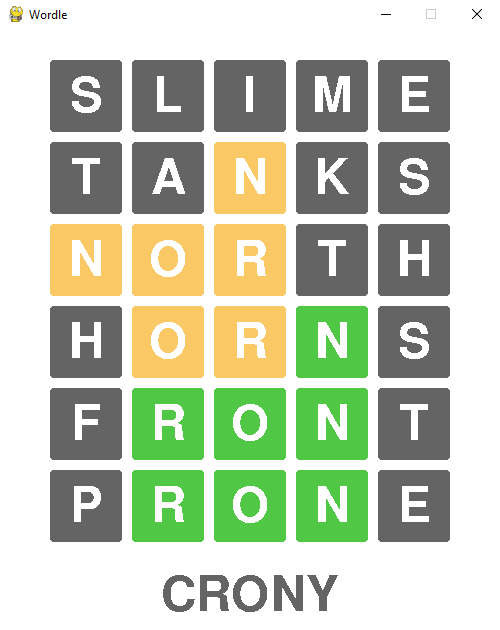

# Wordle-In-Python
The classic word-guessing game from the NY Times, implemented in Python with Pygame

## About

Wordle is a text-based game designed for players to guess a hidden word within five attempts, receiving feedback after each guess by highlighting the correct letters. Developed with pygame, it presents a robust and interactive console interface, with refined guess handling mechanisms. Can you decipher the word within the limited attempts? Play now and find out!

Game Window:

## Controls
 * `Spacebar` : Restarts the game
 * `Esc` : Quits the game
